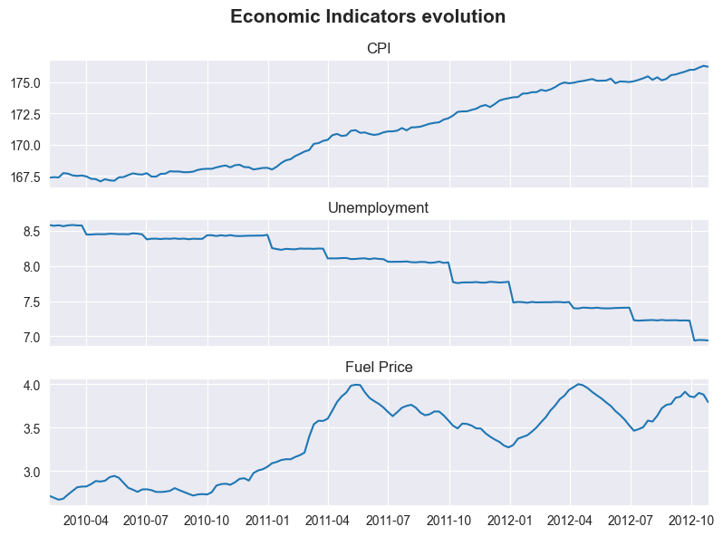
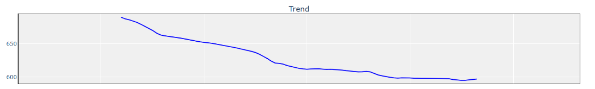

# Walmart-Sales 

:warning:  Modelling in process.

## 0. Introduction

This project is based on a **competition found in Kaggle launched by the Walmart's Recruiting team**. The link to the competition is: https://www.kaggle.com/competitions/walmart-recruiting-store-sales-forecasting/overview

The competition's description is as follows: "In this recruiting competition, job-seekers are provided with historical sales data for 45 Walmart stores located in different regions. Each store contains many departments, and participants must project the sales for each department in each store. To add to the challenge, selected holiday markdown events are included in the dataset."

The objective of the competition was to predict weekly sales for each store, department, and date. Participants were required to submit predictions for a year using historical data from previous years. _For the predictions, only the features were provided, without access to the target variable, making it impossible to evaluate performance on the test set._ 

Although not explicitly required, we will perform a thorough analysis. Due to the large volume of data and the variety of departments, we have defined a methodology for analyzing sales across departments, starting with the development of a dashboard. Following this, a few example cases will be presented.

## 1. Data

### Datasets Overview

The project is composed of **4 different datasets:**
- **stores.csv:** contains anonymized information about the 45 stores, indicating the type and size of store.
- **train.csv:** the historical training data, which covers to 2010-02-05 to 2012-11-01. 
> This file contains the following fields:
>
>Store - the store number  
>Dept - the department number  
>Date - the week   
>Weekly_Sales -  sales for the given department in the given store  
>IsHoliday - whether the week is a special holiday week  
- **test.csv:** This file is identical to train.csv, except there is no weekly sale.
- **features.csv:** This file contains additional data related to the store, department, and regional activity for the given dates. 
>It contains the following fields:
>
>Store - the store number  
>Date - the week 
>Temperature - average temperature in the region 
>Fuel_Price - cost of fuel in the region 
>MarkDown1-5 - anonymized data related to promotional markdowns that Walmart is running. Any missing value is marked with an NA. 
>CPI - the consumer price index 
>Unemployment - the unemployment rate  
>IsHoliday - whether the week is a special holiday week

**In the *data.ipynb* notebook, these datasets were merged into one.** 

### Handling Missing Values

The only missing values are in the markdown features (MarkDown1 to 5). These features have no data before 11-11-2011, and even after that date, some values remain missing. Therefore, while the full dataset spans nearly three years, markdown data is only available for one year.   

  

Markdowns are store-specific, making it difficult to fill missing values. To address this, we examined the trends of these variables across store types, plotting the mean, maximum, and minimum values over time _(see the data_exploration.ipynb notebook)_. We found that stores of the same type displayed similar trends and dimensions. Based on this, we filled missing values using the average for the corresponding store type and date. When no data was available for any store in a given group, we used 0 as the default value.

However, we still have missing values for the initial period, where no markdown data is available. This issue will be addressed during the modeling phase.

## 2. Analysis

### data_exploration.ipynb file

In this notebook, we conduct data exploration to better understand the dataset. The analysis is divided into the following sections:

- **Removing Negative Sales** Filtering out rows where weekly sales are negative, as they are not valid.
- **Store types:** Understanding store classification and reclassifying two stores based on size and department presence.
- **Filling Missing Markdowns:** Explained in section _1. Data (Fill NA Values)_
- **By Department:** Grouping data by department to obtain general statistics (e.g., sales, percentage of total sales). Additionally, performing ANOVA tests to examine correlations between qualitative variables ('IsHoliday') and 'Weekly_Sales', with boxplots created if significant (p-value < 0.01). Finally, performing Pearson correlation tests are used for quantitative variables ('Temperature', 'CPI', 'Unemployment', 'Fuel_Price'), and regression plots are displayed if the correlation is significant (p-value < 0.01).
- **Example Cases:** Visualizing necessary graphs to analyze specific cases.

### Dashboard

As mentioned earlier, the dataset is large and needs to be segmented for focused analysis. A dashboard was developed to facilitate this, providing various analysis elements for individual departments. While not definitive for drawing conclusions, it helps to understand department behavior and serves as a starting point for hypothesis generation.

  

>The dashboard consists of four sections:
> - **Department Selection:** Allows users to select a department through a dropdown menu and display its information using a button.
> - **General stats:**
>> &nbsp;&nbsp;&nbsp;&nbsp;&nbsp;&nbsp;&nbsp;&nbsp;&nbsp;&nbsp;&nbsp;&nbsp;\- General: Time period, total sales, percentage of overall sales, and sales ranking. 
>> &nbsp;&nbsp;&nbsp;&nbsp;&nbsp;&nbsp;&nbsp;&nbsp;&nbsp;&nbsp;&nbsp;&nbsp;\- Store Presence: Percentage of stores carrying the department, broken down by store type. 
>> &nbsp;&nbsp;&nbsp;&nbsp;&nbsp;&nbsp;&nbsp;&nbsp;&nbsp;&nbsp;&nbsp;&nbsp;\- Distribution of Weekly Sales: A boxplot of weekly sales for the selected department over the specified period.
> - **Seasonal Decompose:** Displays the observed sales, trend, seasonal, and residual components for the selected department's weekly sales.
> - **Weekly Sales correlation with other features:** : Regression plots for quantitative variables if a significant Pearson test result (p-value < 0.01) is found, and boxplots for qualitative variables if ANOVA results are significant. If no significant correlation is found, the plot is grayed out with a message displaying the p-value. Five tests are performed:
>> &nbsp;&nbsp;&nbsp;&nbsp;&nbsp;&nbsp;&nbsp;&nbsp;&nbsp;&nbsp;&nbsp;&nbsp;\- Temperature vs Weekly_Sales  
>> &nbsp;&nbsp;&nbsp;&nbsp;&nbsp;&nbsp;&nbsp;&nbsp;&nbsp;&nbsp;&nbsp;&nbsp;\- IsHoliday vs Weekly_Sales  
>> &nbsp;&nbsp;&nbsp;&nbsp;&nbsp;&nbsp;&nbsp;&nbsp;&nbsp;&nbsp;&nbsp;&nbsp;\- CPI vs Weekly_Sales  
>> &nbsp;&nbsp;&nbsp;&nbsp;&nbsp;&nbsp;&nbsp;&nbsp;&nbsp;&nbsp;&nbsp;&nbsp;\- Unemployment vs Weekly_Sales  
>> &nbsp;&nbsp;&nbsp;&nbsp;&nbsp;&nbsp;&nbsp;&nbsp;&nbsp;&nbsp;&nbsp;&nbsp;\- Fuel_Price vs Weekly_Sales 

### Example Cases

To demonstrate the dashboard's utility, we explore two example departments. The dashboard serves as a starting point for examining various factors influencing sales dynamics in the department.

It is important to note that the dataset is anonymized, making it more difficult to analyze since contextual details are missing.

#### Department 28

  

In the dashboard, we see that sales in this department are correlated with temperature, CPI, unemployment, and fuel prices. However, this correlation does not necessarily imply causality. 

> To further investigate the relationship between temperature and sales, we plotted the two variables over time.
>
>

>  
>

>
> Based on the graph, it seems reasonable to conclude that lower temperatures may drive higher sales in this department. However, further context is needed to confirm this hypothesis.

> For the other correlated features, the regression plots are less clear compared to the temperature plot. To dig deeper, we plotted the evolution of these features over time.
>

>  
>

> The trends for CPI, fuel prices, and unemployment are evident: CPI and fuel prices are rising, while unemployment is decreasing. Department 28’s sales also exhibit a decreasing trend, dropping by around 14%. This explains the correlation between sales and these features.  
> 

>  
>

>  However, we cannot definitively conclude causality because of the lack of contextual information. For instance, the second winter period had warmer temperatures, which could explain the decrease in sales.

##### _Conclusions_

- **Sales in this department are influenced by temperature.** Lower temperatures are associated with higher sales.
- **Sales trend decreasing by 14%.** This decline could be attributed to rising CPI or warmer winters, but further context is required to confirm either hypothesis.

#### Department 22

  

The dashboard indicates correlations between sales in this department and all the key variables. However, correlation does not necessarily imply causality.

> To further investigate the relationship between temperature and sales, we plotted both variables over time.
>
>

>  
>

>
> The graph suggests that temperature does not significantly affect sales, which remain stable except for two peaks. We will explore these peaks below.

> To investigate the relationship between holidays periods and sales we plotted them.
>
>

>  
>

>
> The two peaks align precisely with Thanksgiving and Christmas. As shown in the dashboard’s seasonal plot, sales during these weeks are almost 100% higher than usual.

> For the remaining features (CPI, Unemployment, Fuel Price), the relationship is similar to Department 28. CPI and fuel prices trend upward, unemployment trends downward, and sales in Department 22 show a decreasing trend (8.7%).
>
>

>  
>

>
> However, without additional context, we cannot assert causality.

##### _Conclusions_
- **Two sales peaks occur during Thanksgiving and Christmas (+100%).**
- **Sales trend decreasing by 8.7%.** This may be linked to rising CPI, though further context is needed..

## 3. Modelling

:warning: In process.
